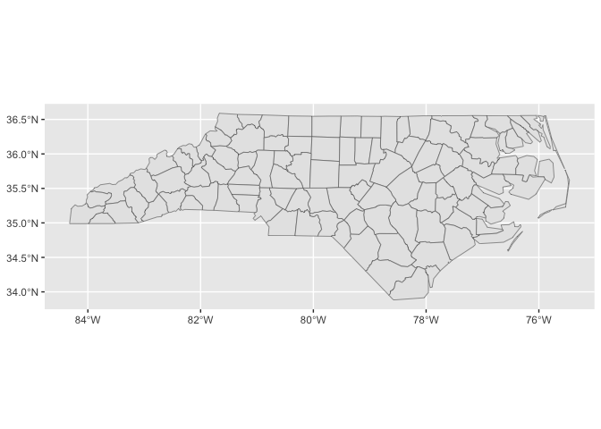
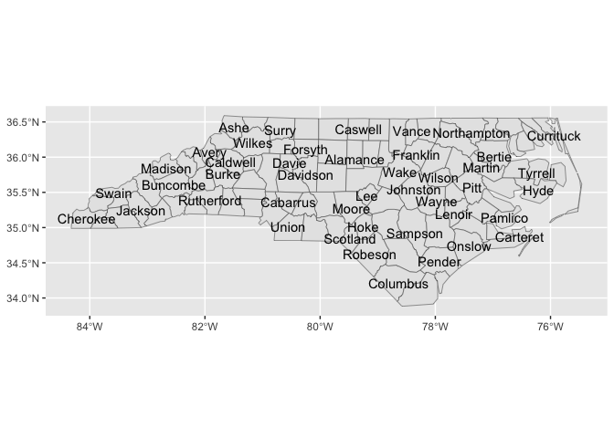
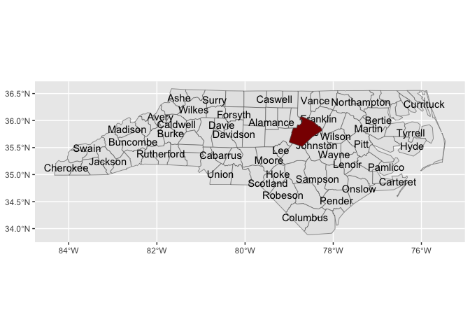
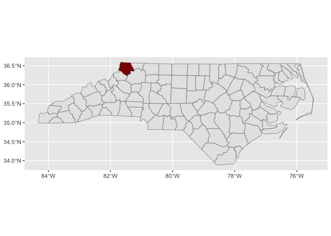
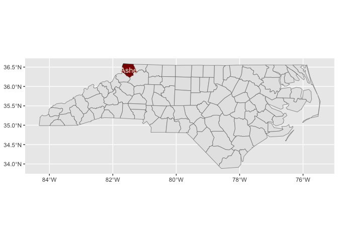

<!-- README.md is generated from README.Rmd. Please edit that file -->

# ggsomewhere

<!-- badges: start -->

<!-- badges: end -->

The goal of ggsomewhere (and it’s github repository) is to provide tools
for building spatial ggplot2 extensions.

The approach makes use of ggplot2’s sf plotting capabilities, the
sf2stat package to prepare reference data for use inside a stat\_\* or
geom\_\* layer, and the readme2pkg package functions for managing
functions from a readme and working with template functions included in
the readme.

## Fully worked example…

How you’d use sf2stat to build functionality with scope, region type,
and location name. When using the code templates for this north carolina
county example, we’ll be replacing ‘scope’, ‘region’, and ‘locations’ as
follows

  - ‘scope’ -\> ‘northcarolina’
  - ‘region’ -\> ‘county’
  - ‘locations’ -\> a vector of region names

Let’s see how we might recreate the functionality in the ggnorthcarolina
package using some templates in this readme.

In the example, the scope of the package is ‘northcarolina’. The region
of interest is ‘county’, and the location names that we are using are
the county names.

## 

``` r
devtools::create(".")
```

## Step 00. prep reference data

### Create

``` r
usethis::use_data_raw()
```

## Preparation

The reference data should have just the id columns and the geometry.
Then it should be named similar to this:

geo\_reference\_northcarolina\_county

Where ‘northcarolina’ is is the character string that will replace
‘scope’ when using the code templates, and ‘county’ is the character
string that will replace region in the

``` r
nc <- sf::st_read(system.file("shape/nc.shp", package="sf"))
#> Reading layer `nc' from data source 
#>   `/Library/Frameworks/R.framework/Versions/4.2/Resources/library/sf/shape/nc.shp' 
#>   using driver `ESRI Shapefile'
#> Simple feature collection with 100 features and 14 fields
#> Geometry type: MULTIPOLYGON
#> Dimension:     XY
#> Bounding box:  xmin: -84.32385 ymin: 33.88199 xmax: -75.45698 ymax: 36.58965
#> Geodetic CRS:  NAD27

geo_reference_northcarolina_county <- nc |>
  dplyr::select(county_name = NAME, fips = FIPS) |>
  sf2stat:::sf_df_prep_for_stat(id_col_name = "county_name")
#> Warning in st_point_on_surface.sfc(sf::st_zm(dplyr::pull(sf_df, geometry))):
#> st_point_on_surface may not give correct results for longitude/latitude data
#> Warning: The `x` argument of `as_tibble.matrix()` must have unique column names if
#> `.name_repair` is omitted as of tibble 2.0.0.
#> ℹ Using compatibility `.name_repair`.
#> ℹ The deprecated feature was likely used in the sf2stat package.
#>   Please report the issue to the authors.
#> This warning is displayed once every 8 hours.
#> Call `lifecycle::last_lifecycle_warnings()` to see where this warning was
#> generated.

usethis::use_data(geo_reference_northcarolina_county, overwrite = T)
#> ✔ Setting active project to '/Users/evangelinereynolds/Google Drive/r_packages/ggsomewhere'
#> ✔ Saving 'geo_reference_northcarolina_county' to 'data/geo_reference_northcarolina_county.rda'
#> • Document your data (see 'https://r-pkgs.org/data.html')
```

``` r
readme2pkg::chunk_to_dir("nc_geo_reference_prep", 
                         dir = "data-raw/")
```

## Use template to create `stat_county()` functionality

``` r
readme2pkg::chunk_variants_to_dir(chunk_name = "stat_region_template",
                                  file_name = "stat_county.R",
                                  replace1 = "scope",
                                  replacements1 = "northcarolina",
                                  replace2 = "region",
                                  replacements2 = "county")
```

``` r
compute_panel_scope_region <- function(data, 
                                       scales, 
                                       keep_id = NULL, 
                                       drop_id = NULL, 
                                       stamp = FALSE){
  
  if(!stamp){data <- dplyr::inner_join(data, geo_reference_scope_region)}
  if( stamp){data <- geo_reference_scope_region }
  
  if(!is.null(keep_id)){ data <- dplyr::filter(data, id_col %in% keep_id) }
  if(!is.null(drop_id)){ data <- dplyr::filter(data, !(id_col %in% drop_id)) }
  
  data
  
}

# step 2
StatSfscoperegion <- ggplot2::ggproto(`_class` = "StatSfscoperegion",
                                `_inherit` = ggplot2::Stat,
                                # required_aes = c("fips|county_name"),
                                compute_panel = compute_panel_scope_region,
                               default_aes = ggplot2::aes(label = after_stat(id_col)))


stat_region <- function(
      mapping = NULL,
      data = NULL,
      geom = ggplot2::GeomSf,
      position = "identity",
      na.rm = FALSE,
      show.legend = NA,
      inherit.aes = TRUE,
      crs = "NAD27", # "NAD27", 5070, "WGS84", "NAD83", 4326 , 3857
      ...) {

  c(ggplot2::layer_sf(
              stat = StatSfscoperegion,  # proto object from step 2
              geom = geom,  # inherit other behavior
              data = data,
              mapping = mapping,
              position = position,
              show.legend = show.legend,
              inherit.aes = inherit.aes,
              params = rlang::list2(na.rm = na.rm, ...)
              ),
              
              coord_sf(crs = crs,
                       default_crs = sf::st_crs(crs),
                       datum = crs,
                       default = TRUE)
     )
  }
```

### test it out `stat_county()`

``` r
source("./R/stat_county.R")

library(ggplot2)

nc <- sf::st_read(system.file("shape/nc.shp", package="sf"))
#> Reading layer `nc' from data source 
#>   `/Library/Frameworks/R.framework/Versions/4.2/Resources/library/sf/shape/nc.shp' 
#>   using driver `ESRI Shapefile'
#> Simple feature collection with 100 features and 14 fields
#> Geometry type: MULTIPOLYGON
#> Dimension:     XY
#> Bounding box:  xmin: -84.32385 ymin: 33.88199 xmax: -75.45698 ymax: 36.58965
#> Geodetic CRS:  NAD27

nc |>
  sf::st_drop_geometry() |>
  ggplot() +
  aes(fips = FIPS) +
  stat_county() + 
  aes(fill = BIR79)
#> Joining with `by = join_by(fips)`
```

<!-- -->

## Use template to create useful derivitive functions

``` r
readme2pkg::chunk_variants_to_dir(chunk_name = "geom_region_template",
                                  file_name = "geom_county.R",
                                  replace1 = "region",
                                  replacements1 = "county")
```

``` r
geom_region <- stat_region
geom_region_label <- function(...){stat_region(geom = "text",...)}
stamp_region <- function(...){
  stat_region(stamp = T, 
              data = mtcars,
              aes(fill = NULL, color = NULL, label = NULL, 
                  fips = NULL, region_name = NULL), 
              ...)}
stamp_region_label <- function(...){
  stat_region(stamp = T, 
              geom = "text", 
              data = mtcars, 
              aes(fill = NULL, color = NULL,
                  fips = NULL, region_name = NULL), 
              ...)}
```

### try those out

``` r
source("./R/geom_county.R")

nc |>
  sf::st_drop_geometry() |>
  ggplot() +
  aes(fips = FIPS) +
  geom_county() + 
  geom_county_label(check_overlap = T,
                    color = "grey85") +
  aes(fill = BIR79) 
#> Joining with `by = join_by(fips)`
#> Joining with `by = join_by(fips)`
```

<!-- -->

``` r

last_plot() + 
  stamp_county() + 
  stamp_county_label()
#> Joining with `by = join_by(fips)`
#> Joining with `by = join_by(fips)`
```

<!-- -->

``` r

ggplot() + 
  stamp_county()
```

<!-- -->

``` r

last_plot() + 
  stamp_county_label(check_overlap = T)
```

<!-- -->

``` r

last_plot() + 
  stamp_county(keep_id = "Wake", fill = "darkred")
```

<!-- -->

## Use template to write convenience functions for each region

``` r
locations <- geo_reference_northcarolina_county$county_name
locations_snake <- tolower(locations) |> 
  stringr::str_replace_all(" ", "_")

readme2pkg::chunk_variants_to_dir(chunk_name = "stamp_region_location", 
                                  file_name = "stamp_county_location.R",
                                  replace1 = "region",
                                  replacements1 = rep("county", length(locations)),
                              replace2 = "location",
                              replacements2 = locations_snake,
                              replace3 = "Location", 
                              replacements3 = locations)
```

``` r
#' Title
#'
#' @param ... 
#'
#' @return
#' @export
#'
#' @examples
stamp_region_location <- function(...){stamp_region(keep_id = 'Location', ...)}

#' Title
#'
#' @param ... 
#'
#' @return
#' @export
#'
#' @examples
stamp_region_label_location <- function(...){stamp_region_label(keep_id = 'Location', ...)}
```

### Try it out

``` r
source("./R/stamp_county_location.R")

nc |>
  sf::st_drop_geometry() |>
  ggplot() +
  aes(fips = FIPS) + 
  stamp_county() + 
  stamp_county_ashe(fill = "darkred")
```

<!-- -->

``` r

last_plot() + 
  stamp_county_label_ashe(color = "oldlace")
```

<!-- -->
